# Aperçu des rendus OpenSCAD

## Assemblage principal

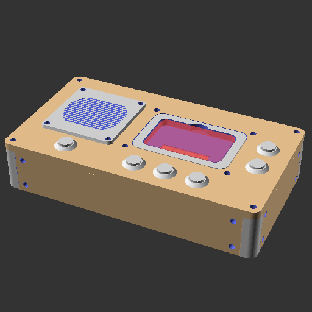

## Composants

### housingComponent
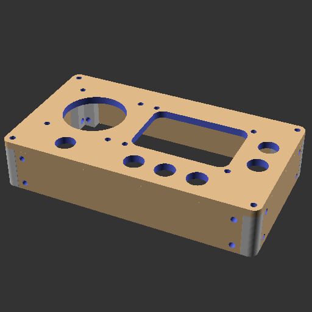

### motherBoardComponent
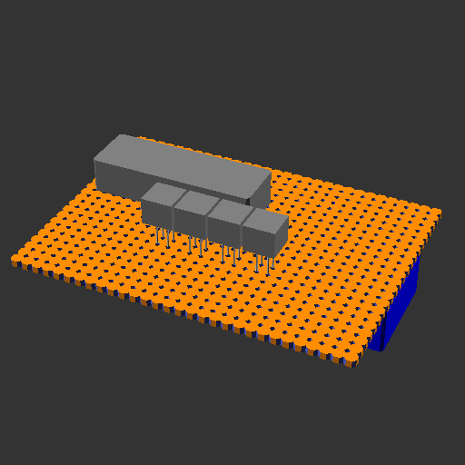

## Pièces

### boltJoinMotherBoardPiece
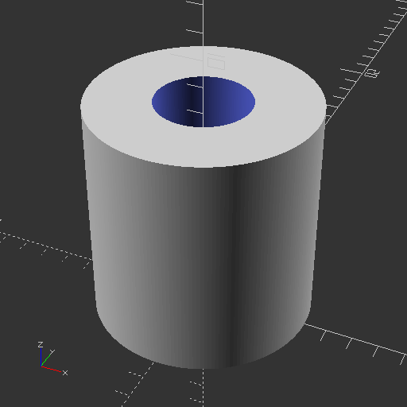

### cassetteCasePiece
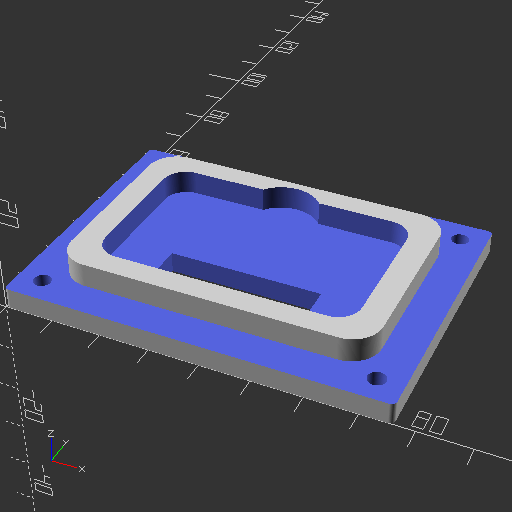

### facadeBackPiece
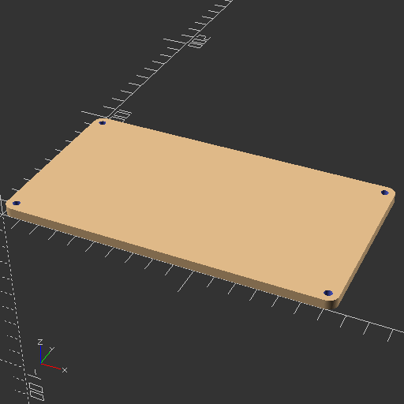

### facadeCornerPiece
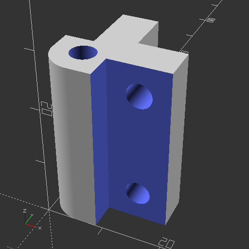

### facadeFrontPiece
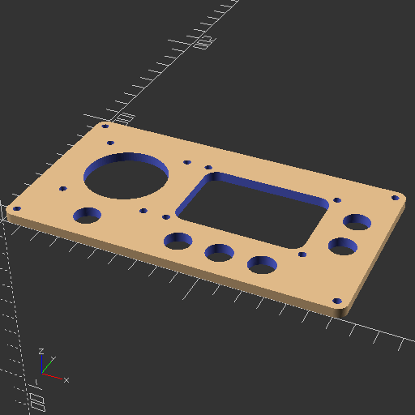

### facade-left-piece
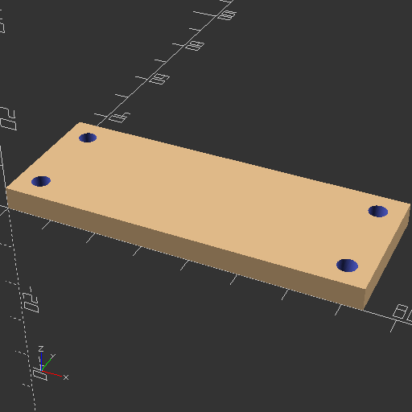

### facadeTopPiece
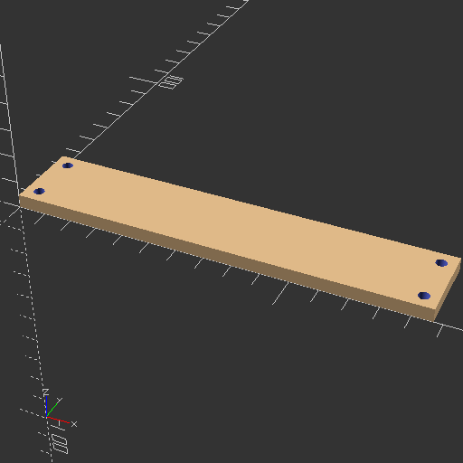

### speakerFacadePiece
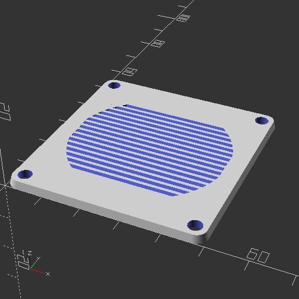

### speakerHolder
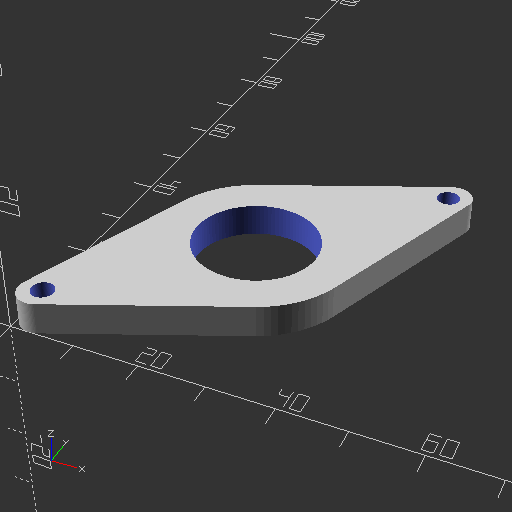

## Cassete Pieces

### cassette3DPrintPiece
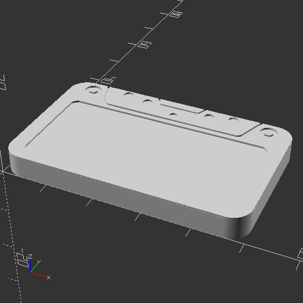

### cassetteCncPiece
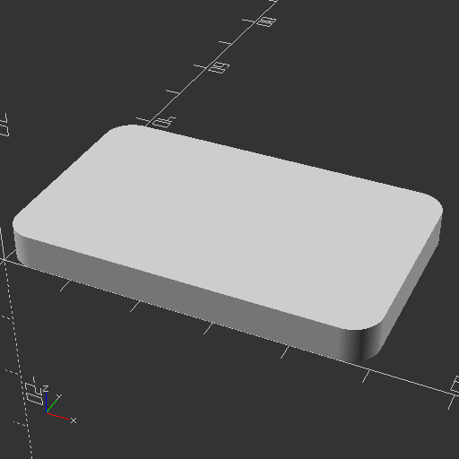

