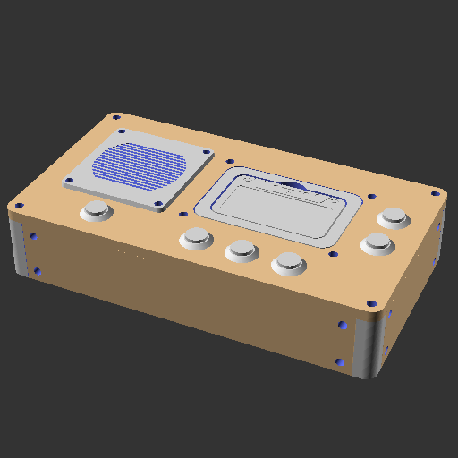

# Aperçu des rendus OpenSCAD

## Assemblage principal

## Composants

### housing-component

### mother-board-component

## Pièces

### bolt-join-mother-board-piece

### cassette-3D-print-piece

### cassette-case-piece

### cassette-cnc-piece

### cassette-piece

### facade-back-piece

### facade-corner-piece

### facade-front-piece

### facade-left-piece

### facade-top-piece

### speaker-facade-piece

### speaker-holder

